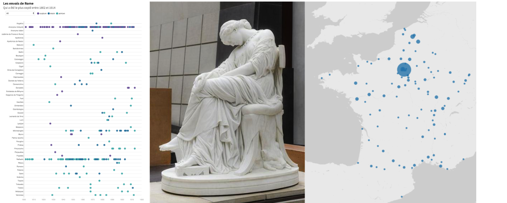

## Contenu de la base

La base publiée sur <a href="https://agorha.inha.fr/inhaprod/ark:/54721/00180">AGORHA</a> recense les travaux envoyés chaque année à Paris par les pensionnaires de l’Académie de France à Rome, peintres et sculpteurs, pour la période 1804-1914. Ils sont mis en relation avec les transcriptions des rapports institutionnels (rapports du directeur de l’Académie de France à Rome, rapports préliminaires rédigés par l’Institut…), permettant de faire émerger des critères de jugement sur ces œuvres.

La base de données permet d’embrasser dans sa globalité une collection unique en son genre, témoignage des résultats d’une politique artistique officielle et institutionnelle sur plus d’un siècle, jadis difficilement appréhendable du fait de l’éclatement des sources et de l’amplitude du cadre chronologique. Les potentialités de l’outil mettent à même l’usager l’utilisateur de sélectionner un genre (peinture, sculpture), un type d’œuvre (dessin, esquisse, bas-relief, groupe sculpté etc.), de rechercher l’ensemble de la production romaine d’un ou plusieurs artistes ou de prendre connaissance de toute personne liée à l’institution (pensionnaires, directeurs, artistes copiés ou cités dans les documents). La transcription des rapports académiques versés dans les mentions d’archives renseignent sur la réception de l’œuvre et permettent de mieux saisir les critères de qualité académique. La possibilité d’exploiter ces archives de manière comparée au sein d’une vaste perspective chronologique permettra de reconstituer « les éléments épars de la doctrine académique » selon la formule de Pierre Vaisse et de construire une histoire du goût officiel et de son évolution sur plus d’un siècle.

> Pour consulter la base sur AGORHA, [n'hésitez pas à télécharger le vademecum de la base](https://github.com/INHAParis/Les-envois-de-Rome_v1/blob/master/Vade_mecum_Envois_de_Rome.pdf) ainsi que le [manuel d'utilisation](https://github.com/INHAParis/Les-envois-de-Rome_v1/blob/master/Guide_utilisation_EnvoisdeRome.pdf) avec les "trucs et astuces" utiles pour une utilisation experte.

Le vademecum contient un chapitre intitulé sources complémentaires où le chercheur trouvera une bibliographie sommaire et les références aux principaux fonds d’archives concernant les envois de Rome.

## Contenu de ce répertoire

Afin de valoriser le contenu de la base de données au-delà de l'interface d'AGORHA, nous rendons ici accessible un **ensemble de ressources (des jeux de données pré-traités, des tutoriels, des exemples de visualisations , etc.)** librement téléchargeables.

Pour rendre compte de la recherche actuelle sur les Envois de Rome, un appel à communication pour le colloque **« Académisme et formation artistique au XIXe siècle : les envois de Rome en question »** <a href="https://www.inha.fr/fr/agenda/parcourir-par-annee/en-2019/mars-2019/les-envois-de-rome-base-de-donnees-peinture-et-sculpture-1804-1914.html">a été publié sur le site de l'INHA</a>.

L'INHA, par cette mise en ligne sous différentes formes, souhaite également expérimenter la réutilisation des données en histoire de l'art en proposant à ceux qui le souhaitent un accompagnement personnalisé, afin d'aider les chercheurs à construire et à formaliser leurs questions à partir des jeux de données.

> Pour toute question, n'hésitez pas à nous contacter à l'adresse suivante : **envoisderome@inha.fr**

Ce répertoire ainsi que la base de données ont été présentés lors d'un atelier à l'INHA le 28 mars 2019

<iframe width="560" height="315" src="https://www.youtube.com/embed/HgwUTBwyyDo" frameborder="0" allow="accelerometer; autoplay; encrypted-media; gyroscope; picture-in-picture" allowfullscreen></iframe>

### Les données

Vous trouverez sur cette page différents jeux de données (œuvres, artistes, etc.) issus de la base de données sous AGORHA, sous différents formats.

[Accéder aux données](./datasets/datasets.md)

### Les tutoriels

Vous trouverez sur cette page, des tutoriels afin de manipuler et de visualiser les jeux de données.

[Accéder aux tutoriels](./tutorials/tutorials.md).

### Exemples de réutilisations

Vous trouverez sur cette page quelques exemples de visualisations réalisées à partir des données de la base des Envois de Rome.

[Accéder aux réutilisations](./visualisations/visualisations.md).

### Quelques ressources

* [Intervention "Introduction à la visualisation de données" de 2016](https://fr.slideshare.net/antoinecourtin/brve-introduction-la-visualisation-de-donnes-en-shs)
* [Manuel en ligne avec des rappels historiques, des exemples, etc.](https://datavizforall.org/)
* pour vous aider à trouver la forme de visualisation la plus adaptée (en fonction des outils, de vos données, de vos questions, etc.)
  * [datavizproject](http://datavizproject.com)
  * [chartmaker](http://chartmaker.visualisingdata.com)
* des outils en ligne pour visualiser/explorer des corpus de données
  * [Palladio](https://hdlab.stanford.edu/palladio/) : Palladio. Visualize complex historical data with ease.
  * [Vistorian](https://networkcube.github.io/vistorian/) : Interactive Visualizations for Dynamic and Multivariate Networks. 
Online and Open Source.
  * [Flourish](https://app.flourish.studio/templates) : Powerful, beautiful, easy data visualisation.
  * [rawgraph](http://app.rawgraphs.io) : The missing link between spreadsheets and data visualization.
  * [uMap](https://umap.openstreetmap.fr/fr/) : éditeur de cartes personnalisées
* des outils de validation, de préparation, de manipulation de données :
  * [Breve](http://hdlab.stanford.edu/breve/)
  * [OpenRefine](http://openrefine.org/)
  * [workbench](http://workbenchdata.com/)

## Equipe
* Responsables
   * Servane Dargnies (2015-2019) - Olivier Bonfait
   * Chantal Georgel, conseillère scientifique (2008-2017)
   * Ariane James-Sarazin, conseillère scientifique (2017-2018)
   * France Lechleiter, cheffe de projet (2016-2019)
* Equipe
   * Érica Champeau, stagiaire (2018)
   * Clara Delannoy, stagiaire (2017)
   * Justine Gain, stagiaire puis chargée d'études et de recherche (2019)
   * Noémie Picard, stagiaire (2018)
   * Josette Saint-Martin, stagiaire (2017)
* Partenaires scientifiques :
   * Francesca Alberti, chargée de mission pour l’histoire de l’art à l'Académie de France à Rome - Villa Médicis (2019-)
   * Olivier Bonfait, professeur d'histoire de l'art moderne à l'Université de Bourgogne
   * Jérôme Delaplanche, chargé de mission pour l'histoire de l'art à l'Académie de France à Rome - Villa Médicis (2015-2018), Centre des Monuments nationaux (2018-)
* Équipe initiale (2002-2004) :
  * Sous la direction d'Olivier Bonfait, alors chargé de mission pour l'histoire de l'art à l'Académie de France à Rome - Villa Médicis : Florence Colin, Christiane Dotal, France Lechleiter, Isabelle Loddé, Hélène Marraud, Laurent Noet, Guillaume Peigné, Delphine Regalasti-Multon, Pierre Sérié, Anne-Blanche Stévenin
* Base de données : 
  * Pierre-Yves Laborde, chargé de ressources documentaires et numériques (2010-)
  * Antoine Courtin, chef du service numérique de la recherche (2015-)

### Partenaires
[Institut national d’histoire de l’art (INHA)](https://www.inha.fr/)
[Académie de France à Rome - Villa Médicis](https://www.villamedici.it/fr/)
[Institut de France - Académie des beaux-arts](https://www.academiedesbeauxarts.fr/accueil)

### Licence
L'ensemble des données mises à disposition  ainsi que les différentes visualisations et tutoriels sont placés sous [licence Creative Commons 4.0](https://creativecommons.org/licenses/by/4.0/deed.fr).

Dans ce cadre, l’utilisateur est autorisé :
* à reproduire et à rediffuser ces données, sous réserve de conserver la mention exacte de la source : Les Envois de Rome en peinture et sculpture, 1804-1914, en partenariat avec l'Institut national d'histoire de l'art, l'Académie de France à Rome - Villa Médidis et l'Académie des beaux-arts de l'Institut de France
* à retraiter, à inclure ou à exploiter ces contenus et données, sous réserve de ne pas en dénaturer le sens ni l’exactitude et de ne pas induire en erreur des tiers quant au contenu ou à la source de ces informations ;
pour le monde entier et sans limitation de durée ;
* à des fins commerciales ou non.
