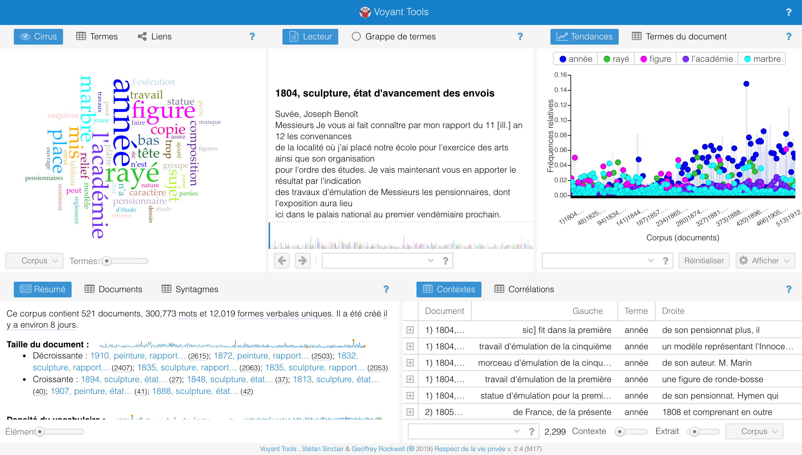

## tutoriels
### Comment utiliser VoyantTools pour explorer le corpus textuel des rapports académiques transcrits.

#### À propos de Voyant Tools
Voyant Tools est un environnement d’analyse, de lecture et de visualisation de textes numériques.

Voici deux ressources indispensables avant de s'y plonger :
* [le tutoriel d'Aurélien Berra](https://github.com/aurelberra/voyant_tools/blob/master/tutorial/voyant_tools_intro_fr.md) qui revient également sur la genèse et les objectifs de Voyant Tools.
* [la documentation officielle de l'outil](http://voyant.tools.huma-num.fr/docs/#!/guide/start)

#### Rappel du corpus

Sur les 603 rapports issus de la base de données, nous avons sélectionné les 521 rapports ayant une transcription.
Deux modes d'accès :

#### 1ère étape : importer les données

* Le jeu de données initial est [à télécharger ici](./datasets/datasets.md) sous format CSV
* Accéder directement au corpus pré-paramétré dans [le projet voyant-tool](http://voyant.tools.huma-num.fr/?corpus=9f0929de55123b653c9475a6be733db4)

#### 2ème étape : Accès à l'interface

L'interface s'ouvre avec 5 modules par défaut dont un le lecteur qui affiche l'ensemble de votre corpus. L'ensemble des rapports est donc lisibles par ordre chronologique de rédaction.

Chaque module possède dans son angle en haut à droite, un lot d'icône qui s'affiche au survol. A ce niveau, vous pouvez soit ajuster le module actuel par différentes options, soit réaliser un export de la visualisation soit choisir un autre module selon vos besoins.

