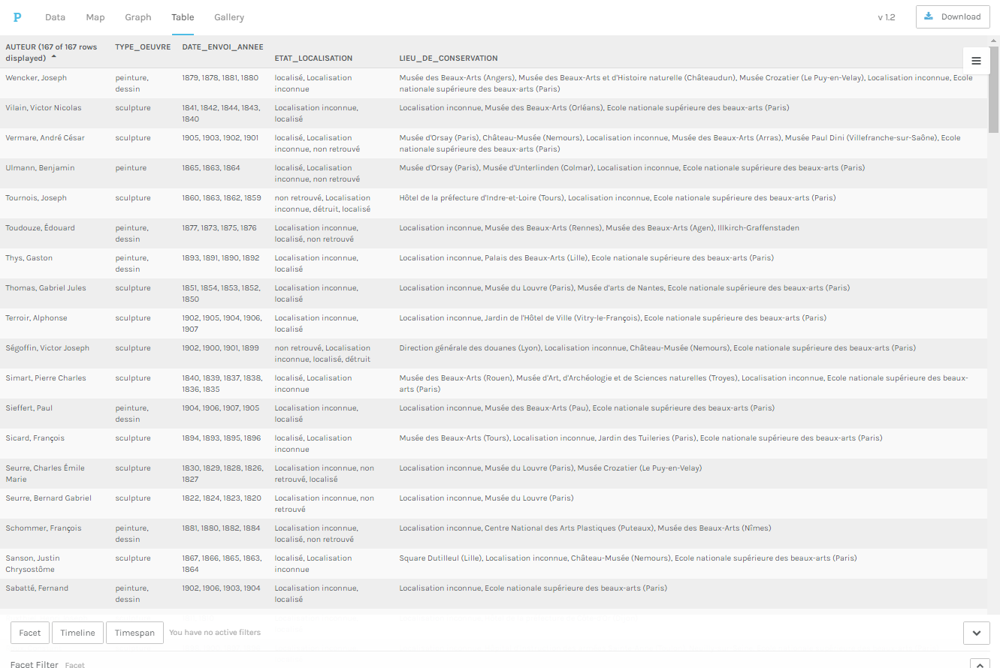
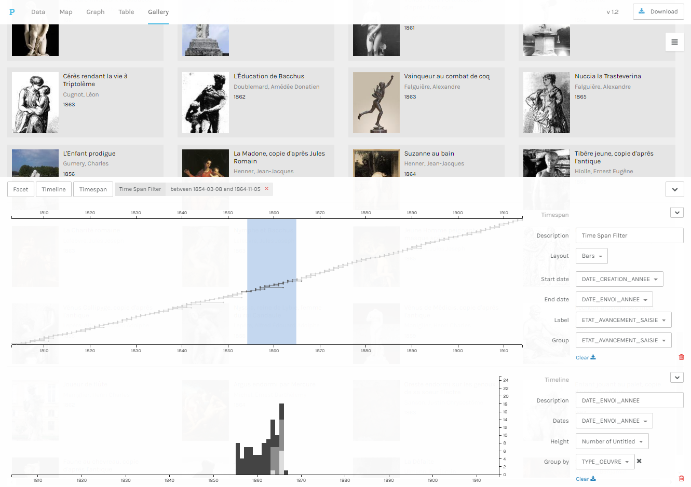
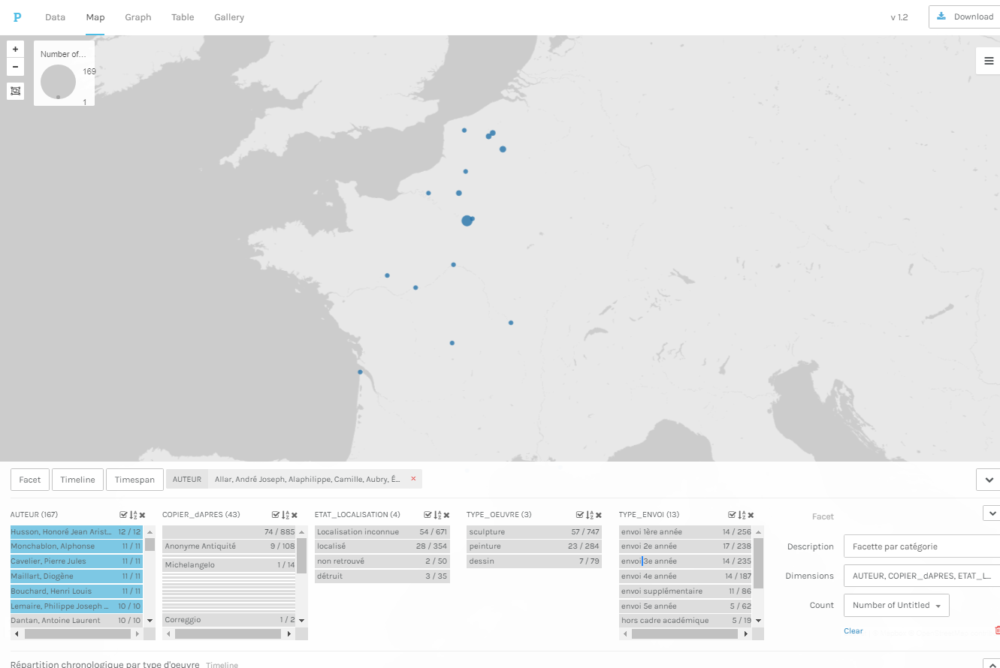

## tutoriels
### Comment utiliser Palladio pour explorer le corpus des Envois de Rome

#### Objectifs

* utiliser Palladio pour explorer le coprus des Envois de Rome
* savoir manipuler les différentes options de l'interface

#### A propos de Palladio

Palladio est	une	plateforme de	visualisations	de	données	à	plusieurs	dimensions	(lettres,	personnes,	données	
biographiques,	lieux,	etc.).	Il	s’agit	d’un		outil	développé	initalement par	les	membres	du	projet	Mapping	the	
Republic	of	Letters à	l’université	de	Stanford	en lien avec le laboratoire Humanities+Design.

**Accéder à l'application :** [http://palladio.designhumanities.org/#/](http://palladio.designhumanities.org/#/)

#### 1er étape : importer les données

Deux méthodes principales :
* soit en important le jeux de données intial en CSV ([à télécharger ici](../datasets/Export_EnvoisdeRome_oeuvres_20190325.csv))
* soit en important un jeux de données déjà pré-paramétré pour l'utilisation avec Palladio ([à télécharger ici](../datasets/Export_EnvoisdeRome_oeuvres_forPalladio_20190325.json)) 

Pour la seconde, méthode, un petit *gif* pour plus d'information

#### Les 4 formes d'exploration

1. La carte

2. Le graphe

3. Le tableau croisé

4. La grille d'image

#### Les filtres

