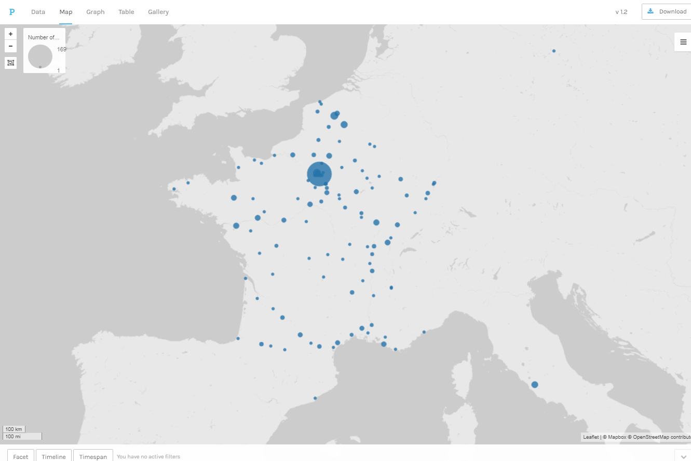
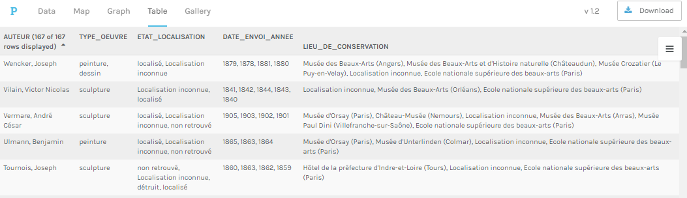
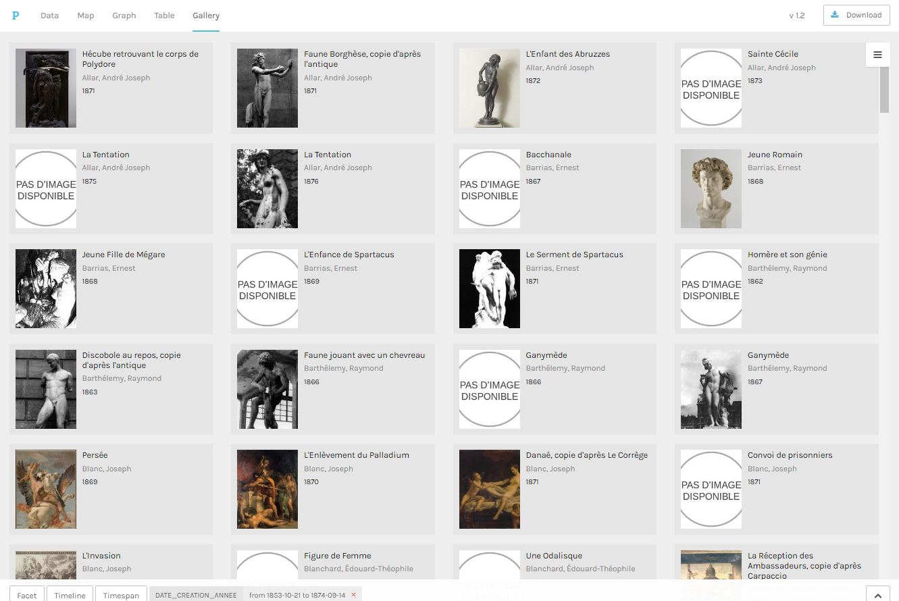
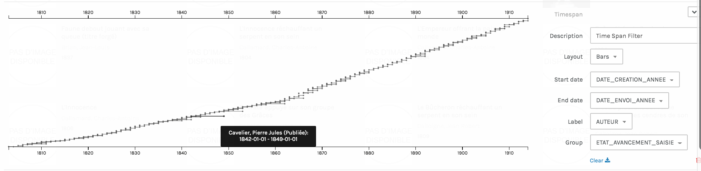

## Tuto
### Comment utiliser Palladio pour explorer le corpus des Envois de Rome

#### Objectifs

* utiliser Palladio pour explorer le coprus des Envois de Rome
* savoir manipuler les différentes options de l'interface

#### A propos de Palladio

Palladio est	une	plateforme de	visualisations	de	données	à	plusieurs	dimensions	(lettres,	personnes,	données
biographiques,	lieux,	etc.).	Il	s’agit	d’un		outil	développé	initalement par	les	membres	du	projet	Mapping	the
Republic	of	Letters à	l’université	de	Stanford	en lien avec le laboratoire Humanities+Design.

**Accéder à l'application :** [http://palladio.designhumanities.org/#/](http://palladio.designhumanities.org/#/)

#### 1er étape : importer les données

Deux méthodes principales :
* soit en important le jeux de données intial en CSV ([à télécharger ici](../datasets/Export_EnvoisdeRome_oeuvres_20190325.csv))
* soit en important un jeux de données déjà pré-paramétré pour l'utilisation avec Palladio ([à télécharger ici](../datasets/Export_EnvoisdeRome_oeuvres_forPalladio_20190325.json))

Pour la seconde, méthode, un petit *gif* pour plus d'information

Une fois les données importées,vous entrez dans l'interface et le menu en haut, vous permet d'accéder aux 4 modes d'exploration ainsu qu'une section "Data" qui contient sous forme de liste , l'ensemble de vos données.  Les type de données les plus courants sont suportés (texte, date, nombres, coordonnées géographiques, url) et seront nécessaire pour réaliser certaines visualisations.

> vous ne pourrez pas faire de carte si aucune colonne ne contient l'information de lattitude et de longitude. De même, pour créer un filtre chronologique, il faudra avoir dans les données, une colonne de type date.

#### Les 4 formes d'exploration

1. La carte

L'accès par carte  permet de visualiser la répartition des Envois de Rome selon leurs lieux de conservation actuelles

2. Le graphe

Le graphe permet de choisir deux variables ("Source" et  "Target") et de visualiser les relations qu'elles entretiennent. Avec l’option « Size nodes », vous pouvez obtenir des tailles de noeuds proportionnels au nombre d’objets qu’ils représentent.
Ci-dessous, nous avons choisis la colonne "AUTEUR" et la colonne "COPIER_dAPRES", et après avoir filtrer sur les, on peut visualiser la réponse à la question suivante : quel(s) sont les auteurs qui ont copié à la fois Michel-Ange et Pinturicchio ? On voit ainsi tout de suite apparâitre qu'il n'ya qu'un seul artiste à savoir Antoine Larée.

3. Le tableau croisé

Le tableau croisé (dans le menu TABLE) permet, après avoir choisi une variable dans les données, d'avoir une concaténation des différentes champs de votre choix.
Par exemple, si vous choisisez comme premièer variable "AUTEUR" et comme dimensions d'analyse, les champs "DATE" ou encore "TYPE_OEUVRES", vous obtiendrez le résultat suivant :

4. La grille d'image

Ce dernier mode d'exploration est le plus visuel. Il vous permet de construire avec les informations de votre choix, une galerie de cartels.

Pour construire ces cartesl, il suffit de paramétrer et de choisir les champs que vous souhaitez voir apparaître. Attention, pour les illustrations vous devez utilisez la colone URL_IMAGE tandis que pour le champ "LINK3 qui permet, au cliq sur la cartel d'être renvoyé à la notice complète d'AGORHA, il faut choisir "URL_AGORHA".

#### Les filtres

La grande force de Palladio réside principalement dans l'utilisation de filtres dynamiques qui vont interragir avec les informations visualisées selon les 4 modes d'explorations vu ci-dessus.

3 type de filtres existent :

* [Facet] : permet d'afficher les valeurs de vos différentes variables et de construire des filtres multiples. Exemple : on va pouvoir sélectionner uniquement les sculptures qui sont des envois de 2ème année et qui ont été copié d'après un antique

* [Timeline] : permet de visualiser et naviguer/sélectionner sur une timeline les vraiables selon des regroupement de votre choix.

* [Timespan] : tout comme la timeline, ce filtre à l'avantage de visualiser une période temporelle. Dans l'exemple ci-dessous, il s'agit de visualiser la période entre la date de création de l'oeuvre et la date de l'envoi de l'oeuvre. On peut ainsi tout de suite voir des cas "sortant de l'ordinaire" comme l'oeuvre

#### Bon à savoir

* **Ne jamais recharger la page** car sinon, vous perdez toutes vos visualisations
* Malheureusement, outil encore en développement, toutes les visualisations ne sont pas exportables (toujours possible de faire des captures d'écran)
* pour chaque visualisation, il y a beaucoup d'options, notamment les "tooltip label" car permettent de choisir ce qui sera affiché dans l'infobulle au passage de la souris.
