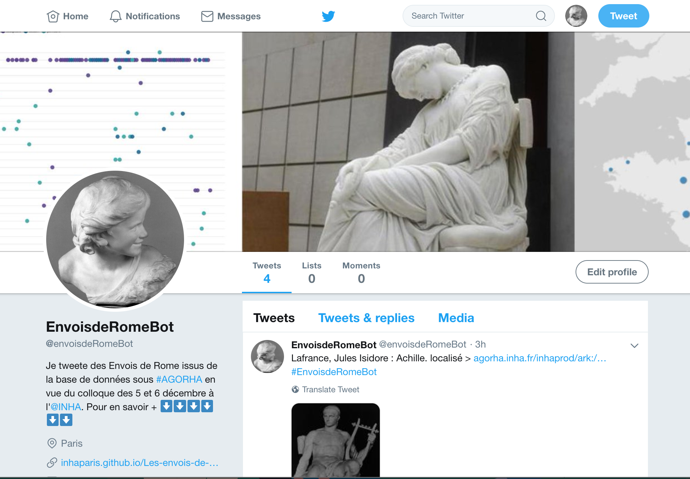
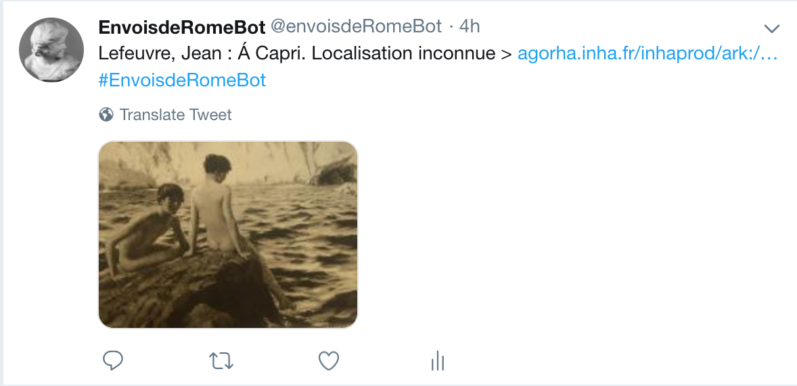

## Réutilisation n°2
### Créer un bot twitter

A partir de l'export des oeuvres, le compte Twitter [EnvoisdeRomeBot](https://twitter.com/envoisdeRomeBot) twittera 2 fois par jours des envois présents dans la base de données afin d'annoncer le colloque de décembre 2019.

Contraint par la limite des 280 caractères de Twitter, le bot tweet des oeuvres en respectant la syntaxe suivante :

> $variable_AUTEUR [:] $variable_TITRE_PRINCIPAL. $variable_ETAT_LOCALISATION > $variable_URL_AGORHA

Ce qui donne, à titre d'exemple :

