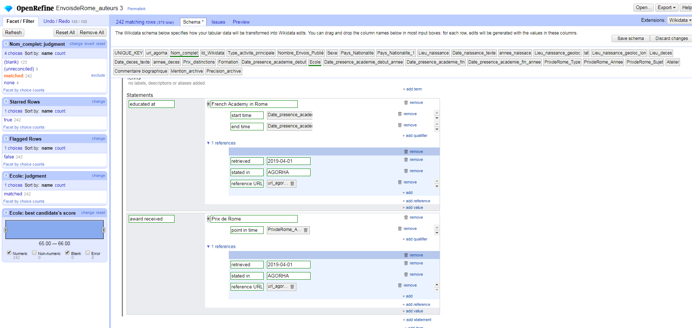

## Réutilisation n°1
### S'interconnecter avec des bases externes - alignement et enrichissement avec wikidata

#### Première étape : aligner les pensionnaires de la base de données avec Wikidata

Réalisé avec OpenRefine, , 85% des pensionnaires ont été alignés. Il y a donc certains pensionnaires qui n'ont pas encore d'id wikidata

#### Seconde étape : enrichir les entrées wikidata avec les données de la base de données

Réalisé grâce à l'extension wikdiata, intégré par défaut dans la version 3.0 d'Open Refine

#### Résultats

Nous avons concentré nos efforts sur les dates de présences à l'Académie en ajoutant à chaque fois la source, à savoir l'url de la notice d'AGORHA mais également en ajoutant des informations concernant le Grand Prix de Rome
Voilà la résultat pour le sculpteur Aimé Blaise 

