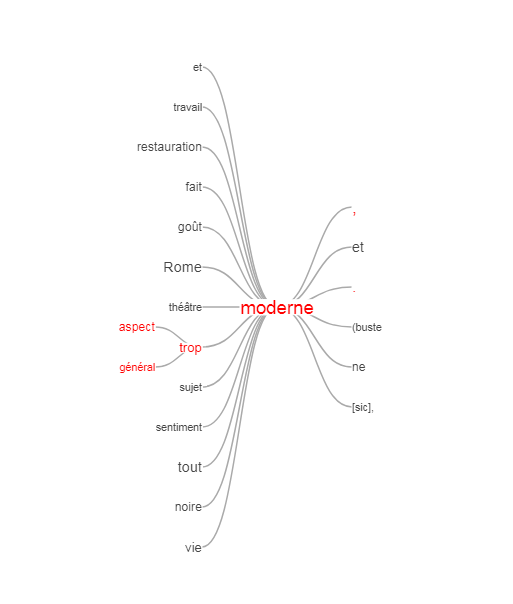

## Visualisation n°1
### Prémices d'analyse textuelle à partir des rapports entourant les Envois de Rome

L'objectif est ici d'utiliser les rapports transcrits comme un matérieux de recherche en lui-même et d'utiliser [**Voyant Tools**](http://voyant.tools.huma-num.fr) service web pour faciliter l'exploration de ce corpus en s'appuyant sur les logiques issue de la textométrie.

> warning n°1 : il s'agit là d'une aide à l'exploration textuelle et non une méthode qui tendrait à remplacer une  lecture analytique plus fine.

> warning n°2 : l'outil utilisé a des limites mais permet d'appréhender certains enjeux liés à ces pratiques empruntant notamment à des discipline avec le traitement automatique des langues.

#### A propos de Voyant Tools
Voyant Tools est un environnement d’analyse, de lecture et de visualisation de textes numériques. 
2 ressources indispensables avant de s'y plonger :
* [le tutoriel d'Aurelien Berra](https://github.com/aurelberra/voyant_tools/blob/master/tutorial/voyant_tools_intro_fr.md) qui revient également sur la génèse et les objectifs de Voyant Tools
* [la documentation officielle de l'outil](http://voyant.tools.huma-num.fr/docs/#!/guide/start)

#### Rappel du corpus

Sur les 603 rapports issus de la base de données, nous avons sélectionné les 521 rapports ayant une transcription dont voici la composition : 
* **167** état d'avancement des envois	
* **136** rapport Institut primitif
* **100** rapport Institut procès-verbal
* **52** rapport Institut à AFR
* **12** rapport EBA procès-verbal
* **9** rapport EBA à AFR
* **8** rapport EBA primitif

rapport Institut séance publique annuelle	37

#### Les premiers réusltats 
Le jeux de données initial est à télécharger ici (avec explication de la structure)

Quelques premiers résultats restant bien sur à approfondir :
* l'utilisation

[Voir le projet voyant-tool](http://voyant.tools.huma-num.fr/?corpus=9f0929de55123b653c9475a6be733db4)

